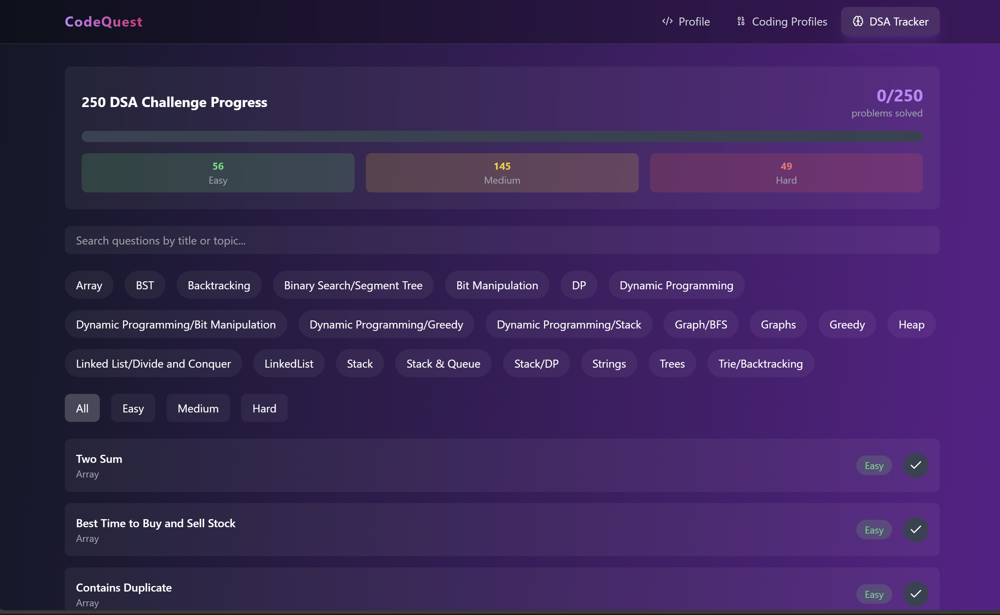
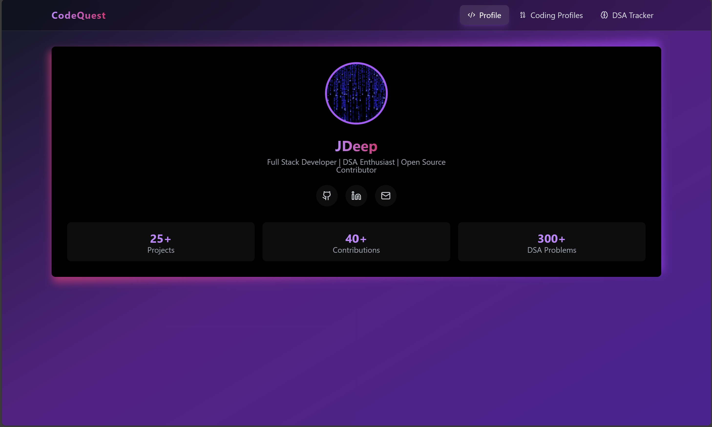

# CodeQuest

**CodeQuest** is a web platform designed to showcase coding profiles and track the progress of users in the world of Data Structures and Algorithms (DSA). With **CodeQuest**, users can create personalized coding profiles, keep track of their DSA progress, and access a wide range of coding problems, all while learning and improving their coding skills.

*Track your progress in DSA topics.*

## Features

- **User Profiles**: Create a personalized coding profile with information such as name, contact, and coding skills.
- **Track DSA Progress**: Track progress in various DSA topics, such as Arrays, Linked Lists, Trees, Graphs, etc.
- **Problem Solving**: Access coding problems sorted by difficulty (Easy, Medium, Hard), and track the problems you've solved.
- **Problem Stats**: Get detailed statistics about your progress in specific DSA topics and problems.

*Showcase your personalized profile.*

## Tech Stack

- **Frontend**: React.js, HTML, CSS, JavaScript, Typescript
- **Backend**: Node.js, Express
- **Deployment**: Vercel

## Installation

### Prerequisites

- Node.js (for backend)
- npm or yarn (for package management)

